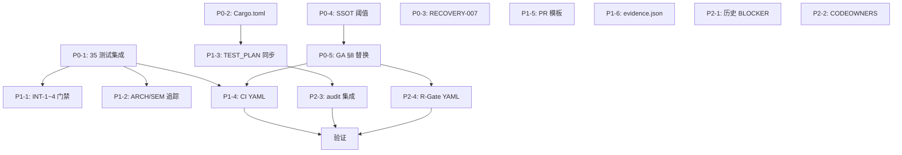

# SQLRustGo v1.0.0–v3.8.0 Comprehensive Feature Tracking DAG

> **Companion to**: COMPREHENSIVE_FEATURE_TRACKING.md
> **Date**: 2026-06-03
> **Version**: v3.8.0

This DAG (Directed Acyclic Graph) defines the execution order for all
rectification tasks identified in the comprehensive feature tracking
audit. The DAG is designed for **parallel execution** by multiple AI
agents or human developers.

---

## Node Definitions (15 nodes)

### P0 Nodes (Critical, 5 nodes)

| Node | Title | Effort | Depends | Parallel-Safe |
|------|-------|--------|---------|---------------|
| **N1** | P0-1: 集成 35 测试到门禁 (D6-Test-Integration) | 8h | - | ✅ |
| **N2** | P0-2: 修复 6 Cargo.toml path 配置 | 4h | - | ✅ |
| **N3** | P0-3: 解 RECOVERY-007 #[ignore] | 2h | - | ✅ |
| **N4** | P0-4: 统一 execution_engine.rs 阈值 SSOT | 3h | - | ✅ |
| **N5** | P0-5: GA_GATE_CHECKLIST §8 替换 | 4h | N4 | - |

### P1 Nodes (Medium, 6 nodes)

| Node | Title | Effort | Depends | Parallel-Safe |
|------|-------|--------|---------|---------------|
| **N6** | P1-1: INT-1~4 写入门禁 D6-CV | 6h | N1 | ✅ |
| **N7** | P1-2: ARCH-1~3 + SEM-1~4 追踪 | 8h | N1 | ✅ |
| **N8** | P1-3: TEST_PLAN vs Cargo.toml 同步 | 4h | N2 | ✅ |
| **N9** | P1-4: CI YAML 集成门禁脚本 | 6h | N1, N5 | - |
| **N10** | P1-5: PR 模板强制测试+门禁 | 2h | - | ✅ |
| **N11** | P1-6: evidence.json 修复 | 4h | - | ✅ |

### P2 Nodes (Process, 4 nodes)

| Node | Title | Effort | Depends | Parallel-Safe |
|------|-------|--------|---------|---------------|
| **N12** | P2-1: v3.0.0 历史 BLOCKER 关闭 | 12h | - | ✅ |
| **N13** | P2-2: CODEOWNERS 多 reviewer | 2h | - | ✅ |
| **N14** | P2-3: audit_testing.sh 集成 | 3h | N8 | - |
| **N15** | P2-4: R-Gate YAML 升级 | 4h | N5 | - |

---

## Dependency Graph



---

## Parallel Groups (for AI agents)

### Group 1: Week 1 (P0 all parallel)
- N1 (8h)
- N2 (4h)
- N3 (2h)
- N4 (3h)
- N5 (4h, after N4)

**5 parallel agents, ~8h wall time**

### Group 2: Week 2-3 (P1)
- After Group 1 completes:
- N6, N7, N8, N9, N10, N11 (some dependent on Group 1)

**6 parallel agents, ~8h wall time**

### Group 3: Week 3 (P2)
- N12, N13, N14, N15 (mostly parallel)

**4 parallel agents, ~12h wall time**

### Group 4: Week 4 (Verification)
- 5-原则验证
- 全 35 测试在门禁中显式调用
- 4 ACTIVE 跨版本债务降到 0

---

## Critical Path

```
N1 → N6/N7 → N9 → Verification
= 8h + 8h + 6h + 8h = 30h (3.75 working days)
```

**Minimum 4-week execution plan**

---

## AI Agent Assignment

Each node corresponds to 1 Gitea Issue (see GITEA_ISSUES_TABLE.md).
Recommended: assign to 1 AI agent per node, with parallel execution
across 5-6 agents in Group 1.

---

## Status Tracking

| Node | Status | Assignee | PR | Issue |
|------|--------|----------|-----|-------|
| N1 | 🔴 TODO | TBD | - | #2866 |
| N2 | 🔴 TODO | TBD | - | #2867 |
| N3 | 🔴 TODO | TBD | - | #2868 |
| N4 | 🔴 TODO | TBD | - | #2869 |
| N5 | 🔴 TODO | TBD | - | #2870 |
| N6 | 🔴 TODO | TBD | - | #2871 |
| N7 | 🔴 TODO | TBD | - | #2872 |
| N8 | 🔴 TODO | TBD | - | #2873 |
| N9 | 🔴 TODO | TBD | - | #2874 |
| N10 | 🔴 TODO | TBD | - | #2875 |
| N11 | 🔴 TODO | TBD | - | #2876 |
| N12 | 🔴 TODO | TBD | - | #2877 |
| N13 | 🔴 TODO | TBD | - | #2878 |
| N14 | 🔴 TODO | TBD | - | #2879 |
| N15 | 🔴 TODO | TBD | - | #2880 |
