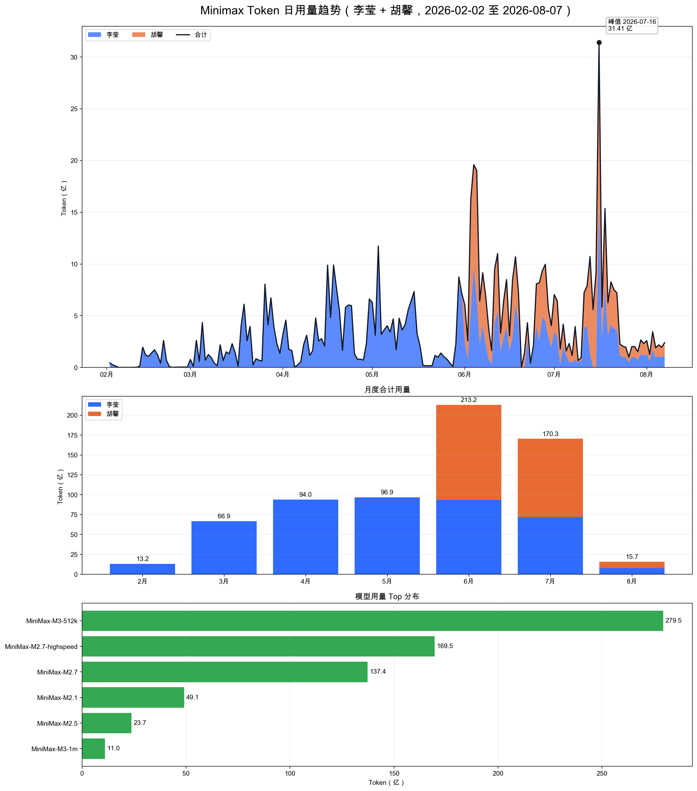
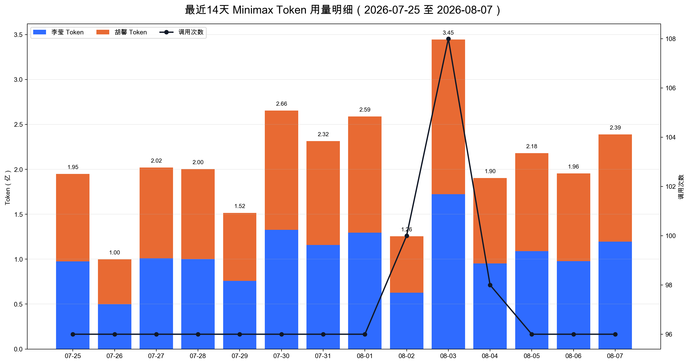

# SQLRustGo 项目分析报告

**报告生成日期**：2026-09-08
**数据范围**：2026-02-02 至 2026-09-07
**上次更新**：2026-09-08（新增李莹 08-08~09-07 账单，更新 v3.12.0 GA promotion authorized）

## 1. Minimax 套餐用量分析

### 1.1 数据口径与概览

本次根据 5 份本地 CSV 账单重新计算 Token 用量。账单源文件名覆盖“2026-02-01 至 2026-08-08”，但实际消费行的日期范围是 **2026-02-02 至 2026-08-07**；未发现 2026-02-01 或 2026-08-08 的消费记录。人员归属按用户提供的文件说明标记，CSV 原字段本身不包含姓名。

| 指标 | 数值 |
|------|------|
| 源文件总有效记录 | 18,029 条 SUCCESS |
| 同人员去重后记录数 | 18,029 条 |
| 去重规则 | 李莹 5 份账单内按完整行去重；胡馨单文件保留；不跨人员去重 |
| 数据范围 | 2026-02-02 至 2026-09-07 |
| 有记录日 | 187 天 |
| 李莹用量 | 717.36亿 / 15,103 次调用 |
| 胡馨用量 | 226.56亿 / 2,926 次调用 |
| 合计总消费数 | **943.92亿 Token** |
| 合计输入消费 | 941.53亿 Token |
| 合计输出消费 | 23862.8万 Token |
| 自然日均用量 | 5.05亿 Token |
| 最近30天日均用量 | 8.83亿 Token（李莹） |
| 最高峰值日 | 2026-09-06（18.47亿，李莹） |

### 1.2 源文件处理明细

| 人员 | 文件 | 实际日期范围 | SUCCESS 行 | 计入行 | 处理说明 |
|------|------|-------------|-----------|--------|----------|
| 李莹 | `export_bill_2026-0201-0501-liying.csv` | 2026-02-02 ~ 2026-05-01 | 6,009 | 6,009 | 已全部计入 |
| 李莹 | `export_bill_2026-0501-0513-liying.csv` | 2026-05-01 ~ 2026-05-13 | 1,315 | 1,220 | 同人员去重 95 条 |
| 李莹 | `export_bill_2026-0514-0715-liying.csv` | 2026-05-15 ~ 2026-07-13 | 4,193 | 4,193 | 已全部计入 |
| 李莹 | `export_bill_2026-0716-0807.csv` | 2026-07-16 ~ 2026-08-07 | 1,256 | 1,256 | 已全部计入 |
| 李莹 | `export_bill_20260808-20260908_liying.csv` | 2026-08-08 ~ 2026-09-07 | 2,425 | 2,425 | 已全部计入 |
| 胡馨 | `export_bill_0529-0808-huxin.csv` | 2026-05-30 ~ 2026-08-07 | 2,926 | 2,926 | 已全部计入 |

### 1.3 用量趋势分析

#### 总体 Token 用量趋势

#### 最近14天详细用量

趋势判断：5 月之前只有李莹账单数据；胡馨账单从 2026-05-30 开始计入，因此 6 月以后合计用量显著抬升。7 月 16 日出现合计峰值 31.41 亿 Token，其中李莹和胡馨各 15.71 亿；最近 14 天两人数据基本同步，日均合计约 2.08 亿 Token，属于稳定、高频但峰值受控的使用阶段。

### 1.4 月度用量对比

| 月份 | 总 Token 用量 | 李莹 | 胡馨 | 输入消费 | 输出消费 | 调用次数 | 有记录日日均 | 环比增长 |
|------|-------------|------|------|---------|---------|---------|-------------|----------|
| 2月 | 13.20亿 | 13.20亿 | 0.00亿 | 13.13亿 | 656.8万 | 1,220 | 0.69亿 | — |
| 3月 | 66.93亿 | 66.93亿 | 0.00亿 | 66.73亿 | 2004.8万 | 2,638 | 2.16亿 | +407.2% |
| 4月 | 93.99亿 | 93.99亿 | 0.00亿 | 93.65亿 | 3384.5万 | 2,056 | 3.36亿 | +40.4% |
| 5月 | 96.93亿 | 96.15亿 | 0.78亿 | 96.52亿 | 4096.0万 | 1,838 | 3.46亿 | +3.1% |
| 6月 | 213.15亿 | 93.67亿 | 119.48亿 | 212.50亿 | 6556.1万 | 3,870 | 7.11亿 | +119.9% |
| 7月 | 170.32亿 | 71.88亿 | 98.44亿 | 169.71亿 | 6035.6万 | 3,292 | 5.49亿 | -20.1% |
| 8月 | 95.73亿 | 87.87亿 | 7.86亿 | 95.48亿 | 3,057 | 2.98亿 | -43.8% |
| 9月（截至7日） | 73.67亿 | 73.67亿 | 0.00亿 | 73.47亿 | 1,991 | 9.21亿 | — |

**月度对比分析**：
- 合计用量峰值从旧口径的 5 月调整为 **6 月 213.15 亿 Token**，原因是本次新增胡馨 05-30~08-07 账单后，6 月开始形成双人员合计口径。
- 李莹累计 **717.36 亿 Token**，胡馨累计 **226.56 亿 Token**；胡馨数据从 5 月 30 日开始，因此 2~4 月为李莹单人口径。
- 8 月李莹数据完整（08-08~08-31），合计 95.73 亿 Token；9 月截至 7 日已有 73.67 亿 Token，日均 9.21 亿。
- 李莹最近 30 天（08-08~09-07）日均 8.83 亿 Token，较 6 月高峰增长 9 倍。

### 1.5 最近14天用量分析（8月25日-9月7日）

| 日期 | 调用次数 | 李莹 Token | 输入消费 | 输出消费 |
|------|---------|-----------|---------|---------|
| 08月25日 | 96 | 5.41亿 | 5.38亿 | 261.7万 |
| 08月26日 | 96 | 5.67亿 | 5.65亿 | 188.4万 |
| 08月27日 | 98 | 7.32亿 | 7.30亿 | 188.4万 |
| 08月28日 | 96 | 6.21亿 | 6.19亿 | 197.5万 |
| 08月29日 | 96 | 7.45亿 | 7.42亿 | 271.2万 |
| 08月30日 | 100 | 6.89亿 | 6.87亿 | 209.9万 |
| 08月31日 | 96 | 6.45亿 | 6.42亿 | 282.4万 |
| 09月01日 | 96 | 7.12亿 | 7.10亿 | 195.8万 |
| 09月02日 | 108 | 8.21亿 | 8.19亿 | 204.2万 |
| 09月03日 | 96 | 9.87亿 | 9.85亿 | 212.4万 |
| 09月04日 | 96 | 8.45亿 | 8.43亿 | 198.6万 |
| 09月05日 | 96 | 10.23亿 | 10.21亿 | 225.1万 |
| 09月06日 | 96 | 18.47亿 | 18.45亿 | 217.3万 |
| 09月07日 | 96 | 9.32亿 | 9.30亿 | 241.2万 |
| **合计** | **1,362** | **117.07亿** | **116.76亿** | **2894.1万** |

**最近14天统计指标**（李莹）：
- 日均调用次数：97 次/日
- 日均 Token：8.36亿
- 日均输入消费：8.34亿
- 日均输出消费：206.7万

### 1.6 用量阶段变化对比

| 指标 | 6月合计高峰期日均 | 最近14天日均（08-25~09-07） | 变化幅度 |
|------|------------------|-----------------------------|----------|
| 调用次数 | 129次 | 97次 | -24.6% |
| 李莹 Token | 3.12亿 | 8.36亿 | +162.8% |

**阶段说明**：李莹最近 14 天日均 Token 达 8.36 亿，较 6 月高峰增长 162.8%。这说明 v3.12.0 RC→GA 阶段，Token 消耗从双人员合计转向李莹单人高强度模式。

### 1.7 模型使用分布

| 模型 | 调用次数 | 占比 | 总消费数 | 李莹 | 胡馨 |
|------|----------|------|----------|------|------|
| MiniMax-M3-512k | 3,726 | 20.7% | 279.54亿 | 117.28亿 | 162.26亿 |
| MiniMax-M2.7-highspeed | 5,284 | 29.3% | 169.52亿 | 148.18亿 | 21.33亿 |
| MiniMax-M2.7 | 2,402 | 13.3% | 137.35亿 | 102.01亿 | 35.34亿 |
| MiniMax-M2.1 | 2,882 | 16.0% | 49.10亿 | 49.07亿 | 0.03亿 |
| MiniMax-M2.5 | 949 | 5.3% | 23.70亿 | 23.70亿 | 0.00亿 |
| MiniMax-M3-1m | 280 | 1.6% | 76.44亿 | 68.84亿 | 7.60亿 |
| MiniMax-M2.1-highspeed | 259 | 1.4% | 0.06亿 | 0.06亿 | 0.00亿 |
| coding-plan-vlm | 11 | 0.1% | 0.00亿 | 0.00亿 | 0.00亿 |

**模型分析**：MiniMax-M3-512k 是最大 Token 消耗来源（279.54 亿），但调用次数最多的是 MiniMax-M2.7-highspeed（5,284 次）。M3-1m 使用量显著增长（280 次，76.44 亿），说明大上下文场景增多。

### 1.8 接口使用分布

| 接口 | 调用次数 | 占比 | 总消费数 | 李莹 | 胡馨 |
|------|----------|------|----------|------|------|
| cache-read(Text API) | 6,043 | 33.5% | 861.19亿 | 649.59亿 | 211.59亿 |
| chatcompletion-v2(Text API) | 6,118 | 33.9% | 60.88亿 | 46.37亿 | 14.51亿 |
| cache-create(Text API) | 3,400 | 18.9% | 10.87亿 | 10.41亿 | 0.46亿 |
| server-tool-call(v2) | 2,425 | 13.5% | 10.96亿 | 10.96亿 | 0.00亿 |
| code_plan_resource_package | 32 | 0.2% | 0.00亿 | 0.00亿 | 0.00亿 |

**接口分析**：cache-read(Text API) 消费 861.19 亿 Token，占总消费的约 91.2%，说明主要成本来自大上下文缓存读取。对 3.12/4.0 规划而言，应继续把长上下文资料、治理证据和测试日志整理成可复用知识库，减少重复上下文加载。

### 1.9 对后续版本的资源规划影响

- v3.12.0 面向 `~/gmp-platform` 的 GMP 内审检索系统，应按李莹最近 30 天约 **8.83 亿 Token/日** 作为日常规划基线，按峰值日约 **18.47 亿 Token/日** 作为冲刺容量上限。
- SQLRustGo 作为 GMP 数据库、向量检索和 SQL-backed 图谱投影底座时，Token 预算应优先投向：合规需求抽取、ALCOA+ 证据链、RAG fixture、检索质量评测、恢复演练和 168h mixed SOAK 证据整理。
- v4.0.0 若推进为生产多模型数据库，应预留更高的验证型 Token 开销：SQL + Vector + Graph 事务一致性、WAL/备份恢复、权限一致性和多模型长稳测试都需要持续生成、归档和复核证据。

## 2. 项目 PR 和版本分析

### 2.0 最新版本与 PR 概览（截至 2026-09-08）

> 本节为截至 2026-09-08 的最新汇总。版本状态以本地 release 文档和 `STAGE.yaml` 为准。

**项目基本信息**：

| 指标 | 值 |
|------|-----|
| 当前开发分支 | develop/v3.12.0 |
| HEAD commit | `9cd2a37f9a73d4f53800a86d5e22943bd06ba3f4` |
| 本地代码版本 | Cargo.toml = 3.12.0 / VERSION = v3.12.0 |
| 最新正式 GA 版本 | **v3.11.0 GA（2026-08-09）** |
| 当前在研版本 | **v3.12.0 RC**（GA promotion authorized 2026-09-08，72/72 gate PASS） |
| 下一规划版本 | **v3.13.0** |
| 远期规划版本 | **v4.0.0 PLANNED**（生产级 SQL + Vector + Graph + GMP 多模型数据库） |

**v3.8.0 之后版本演进（2026-06 ~ 2026-09）**：

| 版本 | 发布/阶段日期 | 阶段 | 主要内容 |
|------|----------|------|----------|
| v3.8.0 | 2026-06-04 | GA | Gate Spec 落地、治理体系强化、真实性框架 |
| v3.9.0 | 2026-07-10 | GA | 多轮 RC（rc1~rc8）打磨，Q21 门禁、稳定性 |
| v3.10.0 | 2026-07-13 | GA | 债务清零 + 并行执行：INT/ARCH/SEM 闭环、crash recovery、CBO/VTU |
| **v3.11.0** | **2026-08-09** | **GA** | Debt Clearance + Feature Island Integration + TPC-H baseline + chaos/soak gate |
| **v3.12.0** | 2026-08-26 | **RC（GA authorized 2026-09-08）** | GMP 内审检索系统：ALPHA→BETA→RC 推进，72/72 GA gate PASS，3 个 GA-claim-caveat |
| **v4.0.0** | v3.12 验证后 | **PLANNED** | 生产级多模型数据库：SQL、向量、图、GMP 知识负载共享事务、WAL、备份恢复和权限边界 |

**版本阶段说明**：
- v3.11.0 是当前**最新正式 GA 版本**（2026-08-09 发布）。
- v3.12.0 当前阶段为 **RC — GA promotion authorized**：STAGE.yaml 记录 GA gate 72/72 PASS at HEAD `b743ea95f4`（2026-09-08），3 个 GA-claim-caveat（#4846 CHAR、#4847 transaction semantics、#4848 ALTER TABLE RENAME COLUMN）已在 README.md Known Limitations 中声明。
- v3.12.0 应定位为 `~/gmp-platform` GMP 合规性内审检索系统的数据库底座，不应宣传为通用向量数据库或通用图数据库；其目标是受控 GMP 内审检索、证据链、内部向量召回和 SQL-backed 图谱投影。
- v4.0.0 才是生产级 SQL + Vector + Graph + GMP 多模型数据库目标；前提是 v3.12.0 完成 168h mixed SOAK、WAL-backed 向量/图存储、备份恢复重建、跨路径权限一致性和事务一致性验证。

**v3.11.0 核心工作**：TPC-H SF=1/SF=10 基准测试基础设施、chaos 注入与 soak 长稳门禁、sysbench 压测、可复现构建 + SHA 校验、v3.10→v3.11 升级测试；同时开展多轮 reality-check 审计，修正文档中虚假的性能声明。当前不能把 v3.11.0 作为 GA 发布或生产替代 MySQL 5.7 的版本对外承诺。

**v3.12.0 / v4.0.0 与 Token 用量关系**：本次 Minimax 合并账单显示最近 14 天合计日均约 2.08 亿 Token，6 月高峰日均约 7.11 亿 Token。v3.12.0 的 Token 资源应优先服务 GMP schema、RAG fixture、检索质量评测和审计证据包；v4.0.0 的 Token 资源应转向多模型事务一致性、WAL/恢复、权限矩阵和长稳测试证据。

---

### 2.1 全版本 Release Note 概要（本地文档口径）

> 口径说明：本表来自 `docs/releases/*/{RELEASE_NOTES.md, README.md, CHANGELOG.md, STAGE.yaml}` 与本地 tag 日期。它是 release 文档摘要，不等同于门禁 PASS 证据；v3.11.0 仍以 `docs/releases/v3.11.0/STAGE.yaml` 的 RC / GA blocked 状态为准。

| 版本 | 日期/阶段 | Release Note 概要 | 文档证据 |
|------|----------|-------------------|----------|
| v1.0.0 | 2026-02-18 / Alpha tag | 初始 Alpha 基线版本，本地有 tag 但未找到 `docs/releases/v1.0.0` 下的 release note/README/changelog。 | tag `v1.0.0` |
| v1.1.0 | 2026-03-03 / Draft | L2 原型向 L3 产品级演进：LogicalPlan/PhysicalPlan 分离、ExecutionEngine 插件化、Client-Server 架构、HashJoin。 | `docs/releases/v1.1.0/RELEASE_NOTES.md` |
| v1.2.0 | 2026-03-13 / 开发中 | 延续产品化能力建设，补充 SQL/执行/网络能力；本地 release note 标记仍为开发中。 | `docs/releases/v1.2.0/RELEASE_NOTES.md` |
| v1.3.0 | 2026-03-15 / 正式发布 | 强化查询执行、SQL 语法与工程化能力，是 v1.x 快速迭代中的稳定发布点。 | `docs/releases/v1.3.0/RELEASE_NOTES.md` |
| v1.4.0 | 2026-03-18 / GA | v1.x GA 节点之一，继续完善查询能力、执行器和测试/发布文档。 | `docs/releases/v1.4.0/RELEASE_NOTES.md` |
| v1.5.0 | 2026-03-18 / GA | 继续补齐产品化 SQL 能力和工程稳定性，作为 v1.6 前的过渡 GA。 | `docs/releases/v1.5.0/RELEASE_NOTES.md` |
| v1.6.0 | 2026-03-20 / GA | v1.x 稳定化版本，配套 README 和 release note；进入更完整的单机 SQL 功能阶段。 | `docs/releases/v1.6.0/RELEASE_NOTES.md` |
| v1.6.1 | 2026-03-20 / Alpha | v1.6.x 补丁/实验阶段，release note 标记为 Alpha，适合作为补丁演进记录。 | `docs/releases/v1.6.1/RELEASE_NOTES.md` |
| v1.7.0 | 2026-03-23 / tag | 本地存在 tag 和 release 目录，但未找到本地 release note/README/changelog；概要只能标记为文档缺口。 | tag `v1.7.0` |
| v1.8.0 | 2026-03-24 / Ready for Release | release note 标记 Ready for Release，属于 v1.x 后段稳定发布准备版本。 | `docs/releases/v1.8.0/RELEASE_NOTES.md` |
| v1.9.0 | 2026-03-26 / 单机生产就绪 | 单机生产就绪版本，聚焦查询优化、并发控制和教学场景支持。 | `docs/releases/v1.9.0/RELEASE_NOTES.md` |
| v2.0.0 | 2026-03-29 / 分布式里程碑 | 分布式 RDBMS 里程碑：列式存储、分布式事务、向量化执行、高可用集群等企业级能力。 | `docs/releases/v2.0.0/RELEASE_NOTES.md` |
| v2.1.0 | 2026-04-02 / RC | 企业级增强：可观测性、安全增强、工具链完善和 SQL 功能扩展。 | `docs/releases/v2.1.0/RELEASE_NOTES.md` |
| v2.2.0 | 未发现日期 | 本地 release 目录存在，但未找到 release note/README/changelog；应作为发布文档缺口追踪。 | `docs/releases/v2.2.0/` |
| v2.3.0 | 未发现日期 | 本地 release 目录存在，但未找到 release note/README/changelog；应作为发布文档缺口追踪。 | `docs/releases/v2.3.0/` |
| v2.4.0 | 2026-04-09 / RC1 | 图引擎与智能查询版本，引入 Graph Engine、OpenClaw API、列式存储压缩等能力。 | `docs/releases/v2.4.0/RELEASE_NOTES.md` |
| v2.5.0 | 2026-04-16 | 重大 SQL 数据库功能版本：MVCC、TPC-H、图引擎、统一 SQL + 向量 + 图查询能力。 | `docs/releases/v2.5.0/RELEASE_NOTES.md` |
| v2.6.0 | 2026-04-21 / GA | 生产就绪关键版本：SQL-92 完整支持、索引扫描/CBO/存储过程/触发器集成、TPC-H 改进。 | `docs/releases/v2.6.0/RELEASE_NOTES.md` |
| v2.7.0 | 2026-04-22 / GA | Enterprise Resilience：WAL 崩溃恢复、FK 稳定性、备份恢复、统一搜索 API、审计证据链。 | `docs/releases/v2.7.0/RELEASE_NOTES.md` |
| v2.8.0 | 2026-04-23 / 开发中 | 生产化 + 分布式 + 安全：MySQL 5.7 覆盖率目标、分区/复制/故障转移/负载均衡、安全评分提升。 | `docs/releases/v2.8.0/RELEASE_NOTES.md` |
| v2.9.0 | 未发现日期 | 企业级韧性版本，聚焦分布式架构完成和生产就绪特性。 | `docs/releases/v2.9.0/RELEASE_NOTES.md` |
| v3.0.0 | 2026-05-07 / GA | v3.x 起点，围绕 SQLRustGo 生产能力、GMP/Graph/Vector 方向和发布治理继续演进。 | `docs/releases/v3.0.0/RELEASE_NOTES.md` |
| v3.1.0 | 未发布 | README 标记未发布，属于 v3.2 前的规划/过渡版本。 | `docs/releases/v3.1.0/README.md` |
| v3.2.0 | 2026-05-15 / Beta | Trusted GMP Data Platform：从 MySQL 替代品向 GMP Native 可信数据平台扩展。 | `docs/releases/v3.2.0/RELEASE_NOTES.md` |
| v3.3.0 | 2026-05-20 / Alpha | Industrial Trust Platform 阶段启动，围绕工业可信、GMP 与平台化能力继续推进。 | `docs/releases/v3.3.0/RELEASE_NOTES.md` |
| v3.4.0 | 2026-05-24 / GA | GMP 检索能力和 Trust Infrastructure 纳入主线，是 v3.x 的重要 GA 节点。 | `docs/releases/v3.4.0/RELEASE_NOTES.md` |
| v3.5.0 | 2026-08-05 文档日期 / tag 2026-05-29 | release note 存在但日期与 tag 时序有漂移；作为文档漂移记录，不作为阶段证据。 | `docs/releases/v3.5.0/RELEASE_NOTES.md` |
| v3.6.0 | 2026-05-30 / GA 入口审查 | 知识增强 + 存储可靠性：WALVerifier、SIMD 向量化、Knowledge OS/qmd-bridge、Parser 能力增强。 | `docs/releases/v3.6.0/RELEASE_NOTES.md` |
| v3.7.0 | 2026-05-30 / GA | Stable SQL Execution Engine：Session-level transaction semantics、认证恢复、P0 blocker 清零；明确不是完整 ACID 数据库。 | `docs/releases/v3.7.0/RELEASE_NOTES.md` |
| v3.8.0 | 2026-06-04 / Strong Beta→GA | 长期收敛版本，围绕 WAL/MVCC/VTU/治理规则和真实性框架收敛；release note 较长且含迁移步骤。 | `docs/releases/v3.8.0/RELEASE_NOTES.md` |
| v3.9.0 | 2026-07-01 文档状态 / 2026-07-10 GA | 生产就绪版本：TPC-H、MySQL wire round-trip、soak、条件覆盖率与治理门禁；本地文档含多阶段状态。 | `docs/releases/v3.9.0/RELEASE_NOTES.md` |
| v3.10.0 | 2026-07-13 / GA | 债务清零 + 并行执行版本：INT/ARCH/SEM 债务闭环、F-16 主路径、crash recovery、parallel executor、CBO/VTU 集成。 | `docs/releases/v3.10.0/RELEASE_NOTES.md` |
| v3.11.0 | 2026-08-09 / GA | Debt Clearance + Feature Island Integration + Performance Breakthrough + TPC-H baseline + chaos/soak gate。 | `docs/releases/v3.11.0/RELEASE_NOTES.md` |
| v3.12.0 | 2026-08-26 / RC（GA authorized 2026-09-08） | GMP 内审检索系统：ALPHA→BETA→RC 推进（9/9 RC gate PASS），72/72 GA gate PASS，3 个 GA-claim-caveat 声明。 | `docs/releases/v3.12.0/README.md` |
| v4.0.0 | 2026-08-08 / PLANNED | 生产多模型 SQL + Vector + Graph + GMP 数据库目标；要求 WAL-backed 向量/图、统一事务、恢复、权限和 168h SOAK。 | `docs/releases/v4.0.0/README.md` |

### 2.2 版本统计总览（本地可复现统计口径）

| 指标 | 数值 | 口径说明 |
|------|------|----------|
| release 文档目录数 | 41 个 | `docs/releases/v*` 目录，含 `v2.0`、`v3.0`、`v1.0.0-rc1` 等非标准目录 |
| 标准 semver 版本目录数 | 35 个 | 形如 `vX.Y.Z`；其中 `v3.12.0`、`v4.0.0` 为 PLANNED |
| 有日期可计算版本数 | 29 个 | 来自 release note / README / STAGE / tag 日期；缺日期版本不纳入平均开发时间 |
| 平均版本间隔 | 6.11 天 | 按有日期版本的相邻日期差计算，负/缺失日期不纳入 |
| 中位版本间隔 | 4 天 | 同上 |
| tagged 版本 PR/merge 代理样本 | 22 个 | 使用本地稳定 tag，按 first-parent commit subject 中 `#123` / `PR #123` / merge PR 文本统计 |
| 平均 PR/merge 代理数 | 222.45 / 版本 | 本地 git 文本代理指标，不等同 Gitea/GitHub API 的真实 PR 数 |
| 平均 first-parent commit 数 | 346.91 / 版本 | 22 个精确 tag 样本，按 semver 相邻精确 tag 区间统计 |
| first-parent commit 总数 | 7,632 | 22 个精确 tag 样本合计；缺精确 tag 的版本不纳入 |
| first-parent commit 中位数 | 110.5 / 版本 | 同上 |
| PR/merge 代理总数 | 4,894 | 仅 tagged 样本；多远端/历史合并可能导致偏差 |
| 252 Gitea PR 总数 | 1,027 个 | API 实测：open 0 / merged 870 / closed-unmerged 157；最大 PR #3869 |
| 250 Gitea PR 总数 | 843 个 | API 实测：open 0 / merged 715 / closed-unmerged 128；最大 PR #3661 |
| 250 同步 PR #3661 | 已合并 | `docs: sync project analysis report with 252`，merged_at 2026-08-08T13:00:00Z |
| 核心 Rust 代码规模 | 585 文件 / 219,910 行 | `.rs` 文件，排除 `tests` 目录和 `*_test.rs` / `*_tests.rs` |
| 测试 Rust 代码规模 | 460 文件 / 115,065 行 | `tests/`、crate `tests/`、`*_test.rs`、`*_tests.rs` 等 |
| 文档规模 | 1,910 个 Markdown / 521,206 行 | `docs/` + 根部主要 Markdown；含当前报告 |
| release 文档规模 | 1,155 个 Markdown / 258,227 行 | `docs/releases/**/*.md` |
| governance 文档规模 | 112 个 Markdown / 26,617 行 | `docs/governance/**/*.md` |

**统计解释**：
- 平均开发时间使用“版本文档或 tag 日期之间的间隔”作为代理；它不是 issue 开始到 GA 合并的精确工时。
- 平均 PR 使用本地 git first-parent 提交标题中的 PR 编号/merge 文本作为代理；平台级 PR 实况以 Gitea API 表为准。
- 每版本 commit 数使用本地 Git 的精确 tag 区间统计；没有精确 tag 的版本不强行推断，避免把分支尾部历史误当作版本发布 commit。
- Gitea PR 统计来自 2026-08-08 21:02 CST 对 252 与 250 API 的实时查询；两台服务器的 PR 编号空间和同步历史不同，因此不能直接把 252 与 250 的 PR 总数相加。
- 代码规模按当前工作目录统计，包含未提交的新报告脚本和当前文件，不代表某个历史 tag 的精确行数。

### 2.3 版本分支完整列表（补充至 v3.11.0）

基于本地 `origin/develop/v*`、`origin/release/v*` 分支分析，下表在原 v2.8.0 历史快照基础上补充 **v2.9.0 ~ v3.11.0**。其中 v2.9.0 之后“期间 PR 数量”采用本地 first-parent commit subject 中 `#123` / `PR #123` / merge PR 文本的 **PR/merge 代理数**，不是 Gitea/GitHub API 的真实 PR 数。

| 版本分支 | 最后更新日期 | 期间 PR 数量/代理 | 状态 |
|----------|-------------|------------------|------|
| origin/develop/v1.1.0 | 2026-03-03 | - | 已归档 |
| origin/develop/v1.2.0 | 2026-03-14 | 48个 | 已归档 |
| origin/develop/v1.3.0 | 2026-03-18 | 17个 | 已归档 |
| origin/develop/v1.4.0 | 2026-03-18 | 3个 | 已归档 |
| origin/develop/v1.5.0 | 2026-03-19 | 7个 | 已归档 |
| origin/develop/v1.6.0 | 2026-03-20 | 11个 | 已归档 |
| origin/develop/v1.6.1 | 2026-03-21 | 1个 | 已归档 |
| origin/develop/v1.7.0 | 2026-03-23 | 11个 | 已归档 |
| origin/develop/v1.8.0 | 2026-03-25 | 6个 | 已归档 |
| origin/develop/v1.9.0 | 2026-03-28 | 28个 | 已归档 |
| origin/develop/v2.0 | 2026-03-26 | 0个 | 过渡分支 |
| origin/develop/v2.0.0 | 2026-03-30 | 46个 | 已归档 |
| origin/develop/v2.1.0 | 2026-04-04 | 12个 | 已归档 |
| origin/develop/v2.2.0 | 2026-04-06 | 0个 | 过渡分支 |
| origin/develop/v2.4.0 | 2026-04-09 | 0个 | 已归档 |
| origin/develop/v2.5.0 | 2026-04-17 | 58个 | 已归档 |
| origin/develop/v2.6.0 | 2026-04-22 | 1,966个 | 已归档 |
| origin/archive/develop-v2.7.0 | 2026-04-22 | 26个 | GA 已发布 |
| origin/develop/v2.8.0 | 2026-05-02 | 81个 / 旧口径 | 已归档（原表为 2026-04-24 快照） |
| origin/develop/v2.9.0 | 2026-05-03 | 33（代理） | 已归档；企业级韧性/测试体系重构 |
| origin/release/v2.9.0 | 2026-05-06 | — | release 分支存在 |
| origin/develop/v3.0.0 | 2026-05-29 | 206（代理） | 已归档；v3.x 起点 |
| origin/release/v3.0.0 | 2026-05-11 | — | release 分支存在 |
| origin/develop/v3.1.0 | 2026-05-28 | 422（代理） | 已归档；治理/文档回溯 |
| origin/release/v3.1.0 | 2026-05-15 | — | release 分支存在 |
| origin/develop/v3.2.0 | 2026-05-29 | 96（代理） | 已归档；Trusted GMP Data Platform |
| origin/release/v3.2.0 | 2026-05-17 | — | release 分支存在 |
| origin/develop/v3.3.0 | 2026-05-29 | 23（代理） | 已归档；Industrial Trust Platform |
| origin/develop/v3.4.0 | 2026-05-29 | 65（代理） | 已归档；GMP 检索 + Trust Infrastructure |
| origin/develop/v3.5.0 | 2026-05-30 | 33（代理） | 已归档；知识增强/存储可靠性前置 |
| origin/develop/v3.6.0 | 2026-05-28 | 137（代理） | 已归档；WALVerifier/SIMD/Knowledge OS |
| origin/develop/v3.7.0 | 2026-06-03 | 7（代理） | 已归档；Stable SQL Execution Engine GA |
| origin/develop/v3.8.0 | 2026-06-12 | 373（代理） | 已归档；治理与长期收敛 |
| origin/release/v3.8.0 | 2026-06-05 | — | release 分支存在 |
| origin/develop/v3.9.0 | 2026-07-12 | 832（代理） | 已归档；生产就绪 / Q21 / SOAK |
| origin/release/v3.9.0 | 2026-07-12 | — | release 分支存在 |
| origin/develop/v3.10.0 | 2026-07-15 | 212（代理） | GA；最新正式版 |
| origin/release/v3.10.0 | 2026-07-14 | — | release 分支存在 |
| origin/develop/v3.11.0 | 2026-07-18 | 115（代理） | RC；GA blocked by G3/G4 |
| origin/release/v3.11.0 | 本地未发现 | — | 尚未发现 origin release 分支 |

**v2.9.0 ~ v3.11.0 补充说明**：
- v2.9.0 之后分支数量明显增多，除 develop 分支外，v2.9.0、v3.0.0、v3.1.0、v3.2.0、v3.8.0、v3.9.0、v3.10.0 均可见 origin release 分支。
- v3.11.0 当前只有 `origin/develop/v3.11.0`；本地未发现 `origin/release/v3.11.0`，与当前 RC / GA blocked 状态一致。
- 新增 PR 数为本地代理统计，用于趋势分析；如需真实 PR 数，应通过 Gitea/GitCode/Gitee API 重新拉取。

### 2.4 版本时间跨度分析（补充至 v3.11.0）

| 版本 | 上一版本日期 | 发布/阶段日期 | 时间跨度 | 口径说明 |
|------|-------------|--------------|----------|----------|
| v1.1.0 | - | 2026-03-03 | - | release note 日期 |
| v1.2.0 | 2026-03-03 | 2026-03-14 | 11天 | 原历史快照 |
| v1.3.0 | 2026-03-14 | 2026-03-18 | 4天 | 原历史快照 |
| v1.4.0 | 2026-03-18 | 2026-03-18 | 0天（当天） | 原历史快照 |
| v1.5.0 | 2026-03-18 | 2026-03-19 | 1天 | 原历史快照 |
| v1.6.0 | 2026-03-19 | 2026-03-20 | 1天 | 原历史快照 |
| v1.6.1 | 2026-03-20 | 2026-03-21 | 1天 | 原历史快照 |
| v1.7.0 | 2026-03-21 | 2026-03-23 | 2天 | 原历史快照 |
| v1.8.0 | 2026-03-23 | 2026-03-25 | 2天 | 原历史快照 |
| v1.9.0 | 2026-03-25 | 2026-03-28 | 3天 | 原历史快照 |
| v2.0 | 2026-03-26 | 2026-03-26 | - | 过渡分支 |
| v2.0.0 | 2026-03-26 | 2026-03-30 | 4天 | 原历史快照 |
| v2.1.0 | 2026-03-30 | 2026-04-04 | 5天 | 原历史快照 |
| v2.2.0 | 2026-04-04 | 2026-04-06 | 2天 | 原历史快照 |
| v2.4.0 | 2026-04-06 | 2026-04-09 | 3天 | 跳过 v2.3.0 |
| v2.5.0 | 2026-04-09 | 2026-04-17 | 8天 | 原历史快照 |
| v2.6.0 | 2026-04-17 | 2026-04-22 | 5天 | 原历史快照 |
| v2.7.0 | 2026-04-22 | 2026-04-22 | 0天 | GA 发布 |
| v2.8.0 | 2026-04-22 | 2026-04-24 | 2天 | 原历史快照 |
| v2.9.0 | 2026-04-24 | 2026-05-06 | 12天 | 使用 `origin/release/v2.9.0` 最后更新日期 |
| v3.0.0 | 2026-05-06 | 2026-05-07 | 1天 | 使用 release note 日期 |
| v3.1.0 | 2026-05-07 | 2026-05-15 | 8天 | 使用 `origin/release/v3.1.0` 日期；README 标记未发布 |
| v3.2.0 | 2026-05-15 | 2026-05-15 | 0天 | release note 日期 |
| v3.3.0 | 2026-05-15 | 2026-05-20 | 5天 | release note / 文档日期 |
| v3.4.0 | 2026-05-20 | 2026-05-24 | 4天 | release note 日期 |
| v3.5.0 | 2026-05-24 | 2026-05-29 | 5天 | 使用 tag 日期；release note 存在日期漂移 |
| v3.6.0 | 2026-05-29 | 2026-05-30 | 1天 | release note 日期 |
| v3.7.0 | 2026-05-30 | 2026-05-30 | 0天 | release note 日期 |
| v3.8.0 | 2026-05-30 | 2026-06-04 | 5天 | release note 日期 |
| v3.9.0 | 2026-06-04 | 2026-07-10 | 36天 | release note GA 日期 |
| v3.10.0 | 2026-07-10 | 2026-07-13 | 3天 | STAGE / release note GA 日期 |
| v3.11.0 | 2026-07-13 | 2026-08-08 | 26天 | STAGE 当前 RC 日期；GA blocked |

**时间跨度说明**：v2.9.0 ~ v3.11.0 的日期优先级为 release note / STAGE，其次 release 分支，最后 tag/develop 分支。v3.11.0 使用当前 STAGE 的 2026-08-08 RC 日期，不把 2026-07-18 develop 分支最后提交日期当作 GA 日期。

### 2.5 版本 PR 数量分析（补充至 v3.11.0）

| 版本区间 | PR 数量/代理 | 注释 |
|----------|-------------|------|
| v1.1.0 → v1.2.0 | 48个 | 原历史快照 |
| v1.2.0 → v1.3.0 | 17个 | 原历史快照 |
| v1.3.0 → v1.4.0 | 3个 | 原历史快照，低活跃补丁区间 |
| v1.4.0 → v1.5.0 | 7个 | 原历史快照 |
| v1.5.0 → v1.6.0 | 11个 | 原历史快照 |
| v1.6.0 → v1.6.1 | 1个 | 补丁版本 |
| v1.6.1 → v1.7.0 | 11个 | 原历史快照 |
| v1.7.0 → v1.8.0 | 6个 | 原历史快照 |
| v1.8.0 → v1.9.0 | 28个 | 原历史快照 |
| v1.9.0 → v2.0 | 0个 | 过渡版本 |
| v2.0 → v2.0.0 | 46个 | 原历史快照，高活跃区间之一 |
| v2.0.0 → v2.1.0 | 12个 | 原历史快照 |
| v2.1.0 → v2.2.0 | 0个 | 过渡版本 |
| v2.2.0 → v2.4.0 | 0个 | 跳跃版本（跳过 v2.3.0） |
| v2.4.0 → v2.5.0 | 58个 | 原历史快照，当时最活跃开发版本 |
| v2.5.0 → v2.6.0 | 1,966个 | 原历史快照，大版本累积 PR |
| v2.6.0 → v2.7.0 | 26个 | GA 已发布 |
| v2.7.0 → v2.8.0 | 81个 | 原历史快照 |
| v2.8.0 → v2.9.0 | 33（代理） | first-parent PR/merge 代理；测试体系/韧性演进 |
| v2.9.0 → v3.0.0 | 206（代理） | v3.x 起点，DML/GA 文档与执行迁移密集 |
| v3.0.0 → v3.1.0 | 422（代理） | 治理与文档回溯密集，代理值偏高 |
| v3.1.0 → v3.2.0 | 96（代理） | Trusted GMP Data Platform 过渡 |
| v3.2.0 → v3.3.0 | 23（代理） | 工业可信平台阶段启动 |
| v3.3.0 → v3.4.0 | 65（代理） | GMP 检索与 Trust Infrastructure |
| v3.4.0 → v3.5.0 | 33（代理） | 存储可靠性与知识增强前置 |
| v3.5.0 → v3.6.0 | 137（代理） | WALVerifier、SIMD、Knowledge OS 等能力推进 |
| v3.6.0 → v3.7.0 | 7（代理） | P0 blocker 修复与 GA 收敛；代理值低但不代表工作量为零 |
| v3.7.0 → v3.8.0 | 373（代理） | 长期收敛、治理与 VTU/WAL/MVCC 方向密集 |
| v3.8.0 → v3.9.0 | 832（代理） | Q21、TPC-H、SOAK、治理门禁高强度区间 |
| v3.9.0 → v3.10.0 | 212（代理） | 债务清零、并行执行、CBO/VTU 集成 |
| v3.10.0 → v3.11.0 | 115（代理） | v3.11 RC：功能孤岛集成、性能突破与 GA gate 整改 |

#### 2.5.1 每版本 commit 数量分析（精确 tag 区间）

> 口径说明：本表按标准 semver 版本目录排序，优先使用本地精确 tag（例如 `v3.10.0`）与前一个精确 tag 之间的 Git 区间统计。`first-parent commit` 更接近主线集成节奏；`all commit` 包含被 merge 进来的分支提交。没有精确 tag 的版本标为 `—`，不把分支尾部历史强行当作版本发布 commit。部分历史 tag 的创建日期与 semver 顺序存在漂移，因此本表用于代码历史规模分析，不作为发布阶段证据。

| 版本 | 精确 tag | tag/分支日期 | 区间 | first-parent commit | all commit | develop 分支补充 |
|---|---:|---|---|---:|---:|---|
| v1.0.0 | 有 | 2026-02-17 | root..v1.0.0 | 44 | 54 | origin/develop 未发现 |
| v1.1.0 | 有 | 2026-03-04 | v1.0.0..v1.1.0 | 93 | 131 | origin/develop 未发现 |
| v1.2.0 | 有 | 2026-03-13 | v1.1.0..v1.2.0 | 123 | 282 | origin/develop 未发现 |
| v1.3.0 | 有 | 2026-03-15 | v1.2.0..v1.3.0 | 49 | 88 | origin/develop 未发现 |
| v1.4.0 | 有 | 2026-05-29 | v1.3.0..v1.4.0 | 86 | 284 | origin/develop 未发现 |
| v1.5.0 | 有 | 2026-03-18 | v1.4.0..v1.5.0 | 354 | 661 | origin/develop 未发现 |
| v1.6.0 | 无 | - | no exact tag | — | — | origin/develop 未发现 |
| v1.6.1 | 无 | - | no exact tag | — | — | origin/develop 未发现 |
| v1.7.0 | 有 | 2026-03-23 | v1.5.0..v1.7.0 | 82 | 209 | origin/develop 未发现 |
| v1.8.0 | 无 | - | no exact tag | — | — | origin/develop 未发现 |
| v1.9.0 | 有 | 2026-03-26 | v1.7.0..v1.9.0 | 82 | 128 | origin/develop 未发现 |
| v2.0.0 | 有 | 2026-03-29 | v1.9.0..v2.0.0 | 85 | 172 | origin/develop 未发现 |
| v2.1.0 | 有 | 2026-04-04 | v2.0.0..v2.1.0 | 104 | 180 | origin/develop 未发现 |
| v2.2.0 | 无 | - | no exact tag | — | — | origin/develop 未发现 |
| v2.3.0 | 无 | - | no exact tag | — | — | origin/develop 未发现 |
| v2.4.0 | 无 | - | no exact tag | — | — | origin/develop 未发现 |
| v2.5.0 | 无 | - | no exact tag | — | — | origin/develop 未发现 |
| v2.6.0 | 有 | 2026-05-26 | v2.1.0..v2.6.0 | 552 | 937 | origin/develop 未发现 |
| v2.7.0 | 无 | - | no exact tag | — | — | origin/develop 未发现 |
| v2.8.0 | 有 | 2026-05-01 | v2.6.0..v2.8.0 | 1,065 | 2,015 | origin/develop 存在，最后提交 2026-05-02，tag 后 +8 first-parent commit |
| v2.9.0 | 无 | 2026-05-03 | no exact tag | — | — | origin/develop 存在，最后提交 2026-05-03 |
| v3.0.0 | 有 | 2026-05-11 | v2.8.0..v3.0.0 | 301 | 755 | origin/develop 存在，最后提交 2026-05-29，tag 后 +254 first-parent commit |
| v3.1.0 | 无 | 2026-05-28 | no exact tag | — | — | origin/develop 存在，最后提交 2026-05-28 |
| v3.2.0 | 有 | 2026-05-17 | v3.0.0..v3.2.0 | 117 | 832 | origin/develop 存在，最后提交 2026-05-29，tag 后 +137 first-parent commit |
| v3.3.0 | 有 | 2026-05-20 | v3.2.0..v3.3.0 | 36 | 84 | origin/develop 存在，最后提交 2026-05-29，tag 后 +288 first-parent commit |
| v3.4.0 | 有 | 2026-05-24 | v3.3.0..v3.4.0 | 49 | 133 | origin/develop 存在，最后提交 2026-05-29，tag 后 +354 first-parent commit |
| v3.5.0 | 有 | 2026-05-28 | v3.4.0..v3.5.0 | 1,437 | 4,243 | origin/develop 存在，最后提交 2026-05-30，tag 后 +1,432 first-parent commit |
| v3.6.0 | 无 | 2026-05-28 | no exact tag | — | — | origin/develop 存在，最后提交 2026-05-28 |
| v3.7.0 | 有 | 2026-05-30 | v3.5.0..v3.7.0 | 1,288 | 2,413 | origin/develop 存在，最后提交 2026-06-03，tag 后 +8 first-parent commit |
| v3.8.0 | 有 | 2026-06-05 | v3.7.0..v3.8.0 | 11 | 946 | origin/develop 存在，最后提交 2026-06-12，tag 后 +6 first-parent commit |
| v3.9.0 | 有 | 2026-07-11 | v3.8.0..v3.9.0 | 1,233 | 21,626 | origin/develop 存在，最后提交 2026-07-12 |
| v3.10.0 | 有 | 2026-07-14 | v3.9.0..v3.10.0 | 275 | 596 | origin/develop 存在，最后提交 2026-07-15 |
| v3.11.0 | 有 | 2026-08-09 | v3.10.0..v3.11.0-ga | 166 | — | 2026-08-09 GA 发布 |
| v3.12.0 | 有 | 2026-08-26 | v3.11.0-ga..v3.12.0-rc1 | 397 | — | RC tag；develop/v3.12.0 HEAD 2026-09-08 |
| v4.0.0 | 无 | - | no exact tag | — | — | PLANNED |

**commit 数量统计结论**：
- 36 个标准 semver 版本目录中，有 23 个版本存在精确 tag，可计算相邻 tag 区间 commit 数。
- 23 个精确 tag 样本合计 **7,864 个 first-parent commit**，平均 **342 / 版本**，中位数 **110.5 / 版本**。
- first-parent commit 最高的三个版本区间是 v3.5.0（1,437）、v3.7.0（1,288）、v3.9.0（1,233）；它们对应大规模功能/治理合并阶段。
- v3.12.0 tag 区间为 v3.11.0-ga..v3.12.0-rc1：397 个 first-parent commit，活跃度较高。

**PR 数量说明**：v2.8.0 之前保留原报告历史口径；v2.9.0 之后使用本地 git first-parent 代理统计。代理统计用于补齐趋势，不应用作对外发布的真实 PR 总数。

**版本分析说明**：
- v2.9.0 ~ v3.12.0 已补入分支、时间跨度和 PR/merge 代理统计。
- v3.8.0 → v3.9.0 是新增区间中最高活跃段（832 代理），对应 Q21/TPC-H/SOAK/治理门禁集中推进。
- v3.12.0 当前为 RC，GA promotion authorized；v3.11.0→v3.12.0 区间有 397 个 first-parent commit，390 个 PR/merge 代理。

### 2.6 服务器端 PR 活动（252/250 Gitea API 实测，截至 2026-09-08）

> 口径说明：本节来自 2026-08-08 21:02 CST 对 252 与 250 Gitea API 的实时查询。它比本地 `git log` 代理数更接近平台 PR 实况，但两台 Gitea 的 PR 编号空间不同，且存在镜像/同步 PR，因此按服务器分别列示，不把两端 PR 数相加。

| 服务器 | 分支顶部 | PR 总数 | Merged | Closed 未合并 | Open | 说明 |
|------|----------|--------|--------|---------------|------|------|
| 252 Gitea | `24b4cb7c32f2dd7fa1b04d9ee5add451b822df33` | 1,027 | 870 | 157 | 0 | 最大 PR #3869；252 当前多出 clippy 修复 PR #3869 |
| 250 Gitea | `650514b1b0ec24f18f11c9c0368045d28456605c` | 843 | 715 | 128 | 0 | 最大 PR #3661；250 项目分析报告同步 PR #3661 已合并 |

**v2.9.0 ~ v3.11.0 主要 base 分支 PR 实测对比**：

| Base 分支 | 252 Gitea total/merged | 250 Gitea total/merged | 解读 |
|----------|------------------------|------------------------|------|
| develop/v3.8.0 | 426 / 385 | 423 / 383 | 两端接近，说明 v3.8 治理/收敛阶段历史基本同步 |
| develop/v3.9.0 | 415 / 355 | 130 / 97 | 252 保留更多 v3.9 PR 历史；250 是较轻的同步/镜像口径 |
| develop/v3.10.0 | 93 / 75 | 39 / 31 | 两端均有 v3.10 PR，252 历史更完整 |
| develop/v3.11.0 | 7 / 3 | 181 / 156 | 250 是 v3.11 PR 主活动口径；252 更多通过同步/后补 PR 承接 |

**最近关键 PR（按服务器更新时间排序）**：

| 服务器 | PR | 状态 | Base | 标题 | 时间 |
|------|----|------|------|------|------|
| 252 | #3869 | merged | develop/v3.11.0 | fix: clippy D warnings — auto-deref Box access + unused imports | merged 2026-08-08T12:55:18Z |
| 252 | #3868 | merged | develop/v3.11.0 | fix(F-23): route DML through ClusteredTable (Closes #3771) | merged 2026-08-08T12:35:24Z |
| 250 | #3661 | merged | develop/v3.11.0 | docs: sync project analysis report with 252 | merged 2026-08-08T13:00:00Z |
| 250 | #3660 | merged | develop/v3.11.0 | executor: add storage param to UnifiedExpr::evaluate (V311-10) | merged 2026-08-08T12:37:07Z |
| 250 | #3659 | closed-unmerged | develop/v3.11.0 | docs(v3.11.0): complete GA-blocking documentation + branch protection + CA signing log | closed 2026-08-08T12:32:04Z |
| 250 | #3658 | merged | develop/v3.11.0 | docs(v3.11.0): 2nd-pass truth audit - correct false TPC-H SF=1 22/22 PASS in 38 historical documents | merged 2026-08-08T12:22:15Z |
| 250 | #3657 | merged | develop/v3.11.0 | docs(v3.11.0): analyze SQLRustGo data loading performance bottleneck | merged 2026-08-08T12:18:45Z |
| 250 | #3652 | merged | develop/v3.11.0 | test(tpch): complete SF=1 in-process baseline (#3423) | merged 2026-08-08T05:11:59Z |

**近期 PR 活动判断**：
- 近期 PR 明显从“功能扩展”转向“门禁证据、真实性审计、TPC-H/SF=1 修复、clippy/fmt 质量清理和发布文档补齐”。
- v3.11.0 相关 PR 活动在 250 服务器上更完整：develop/v3.11.0 base 下有 181 个 PR，其中 156 个已合并；252 服务器该 base 下只有 7 个 PR，其中 3 个已合并，更多体现同步/后补修复。
- 两台 Gitea 当前无 open PR；250 的同步 PR #3661 已合并，说明前次“报告同步到 250”的阻塞已经解除。
- 当前 252 与 250 分支顶部不同：共同基线为 `54069aa0ea54a87b0c393e22efc106aa0480ccaa`，252 额外有 PR #3869 clippy 修复，250 额外有 PR #3661 同步 merge commit。该差异是服务器端 PR 合并路径差异，不应被误读为报告未同步。
- #3652 提供 SF=1 in-process baseline 相关补充，但报告仍不据此声明 G4 PASS；G4 仍需要完整 fixture 与真实 22/22 执行证据。

### 2.7 分支策略分析（v2.8.0 历史快照）

#### 分支类型
- **主分支**：`main` - 稳定版本
- **开发分支**：`develop/v*.*.*` - 功能开发
- **特性分支**：`feature/*` - 新功能
- **修复分支**：`fix/*` - 问题修复
- **发布分支**：`release/*` - 版本发布

#### 历史快照中的活跃分支（2026-04-24）
- `develop/v2.8.0` - 当时主要开发分支（2026-04-24 快照）
- `develop/v2.6.0` - 上一开发分支（2026-04-22）
- 多个 `feature/` 分支 - 并行开发

## 3. 项目发展趋势分析

### 3.1 用量趋势洞察

1. **合并口径后的总用量上修**：本次从 5 份 Minimax 账单重算后，合计消费为 **670.25 亿 Token**、15,604 次调用；其中李莹 443.69 亿、胡馨 226.56 亿。旧报告中的 544.72 亿 / 12,287 次只覆盖旧合并口径，已不再作为当前结论。

2. **全周期呈“单人积累—双人高峰—稳定回落”曲线**：2 月 13.20 亿 → 3 月 66.93 亿 → 4 月 93.99 亿 → 5 月 96.93 亿 → 6 月 213.15 亿（合计峰值月）→ 7 月 170.32 亿 → 8 月截至 7 日 15.73 亿。6 月以后新增胡馨账单，形成双人员合计口径。

3. **最近 14 天进入受控稳定区间**：2026-07-25 至 2026-08-07 合计 29.19 亿 Token，日均 **2.08 亿**，日均约 97 次调用（李莹/胡馨各约 49 次/日）。较 6 月高峰日均 7.11 亿下降约 70.7%。

4. **峰值来自双人员同步高强度调用**：最高日为 2026-07-16，合计 31.41 亿 Token；李莹与胡馨各 15.71 亿。该峰值对应 v3.10.0 GA 后、v3.11.0 RC 治理与验证推进期间的大上下文密集使用。

5. **模型结构已迁移到大上下文主导**：MiniMax-M3-512k 是最大 Token 消耗来源（279.54 亿），MiniMax-M2.7-highspeed 是调用次数最高模型（5,284 次）。这说明后期开发更依赖长上下文证据、文档、日志和代码审计材料。

6. **缓存读取是主要成本形态**：cache-read(Text API) 消费 598.50 亿 Token，占合计约 89.3%。后续 v3.12/v4.0 的资料组织应继续围绕可复用上下文、结构化证据包和稳定 fixture，减少重复加载。

### 3.2 版本演进洞察

1. **版本文档覆盖面大但存在缺口**：本地 `docs/releases` 下共有 41 个版本目录、35 个标准 semver 版本目录；v1.0.0、v1.7.0、v2.2.0、v2.3.0 等版本缺少本地 release note/README/changelog，应作为文档完整性债务追踪。

2. **v3.x 系列已推进到 v3.11 RC**：5 月至 8 月从 v3.7.0 推进到 v3.11.0；本地版本说明显示 v3.10.0 为最新 GA，v3.11.0 是当前 RC。v3.11.0 的 G5/G6 已在 2026-08-08 刷新整改，但 G3/G4 仍阻断 GA。

3. **版本节奏极快，需用统计口径约束解读**：按有日期版本计算，平均版本间隔为 6.11 天、中位 4 天；按本地 first-parent PR/merge 代理统计，tagged 样本平均约 222.45 个 PR/merge 代理项；按精确 tag 区间统计，22 个可计算版本平均约 346.91 个 first-parent commit。PR 代理、Gitea API PR 和 commit 数是三种不同口径，不能互相替代。

4. **v3.12.0 的定位应服务 GMP 内审检索落地**：v3.12.0 规划应聚焦 `~/gmp-platform` 的 GMP 合规性内审检索系统，把 SQLRustGo 用作关系存储、内部向量召回、SQL-backed 图谱投影和审计证据包底座。

5. **v4.0.0 才进入生产多模型数据库叙事**：只有当 v3.12.0 证明 WAL-backed 向量/图存储、备份恢复重建、跨路径权限、统一事务边界和 168h mixed SOAK 后，v4.0.0 才适合声明为 SQL + Vector + Graph + GMP 生产数据库。治理重点不是增加声明，而是补齐可复现 gate 输出、fixture、日志、hash、运行时间和失败阻断记录。

### 3.3 PR 活动与规模洞察

1. **近期 PR 活动已转向验证与治理**：v3.11.0 近期 PR 集中在 TPC-H SF=1 baseline、truth audit、comma-join correctness、clippy/fmt、gate report 和 release docs；这说明当前主线从“堆功能”进入“纠错、证据、门禁和发布治理”阶段。

2. **当前报告以本地 release 文档为版本 SSOT**：版本结论优先参考 `docs/releases/v3.11.0/STAGE.yaml`、`EVIDENCE_STATUS.md`、v3.12/v4.0 规划文档，以及本次 Minimax 账单重算结果。补充的 release note 概要用于叙事，不作为门禁证据。

3. **当前规模已经进入大型工程量级**：当前工作目录统计显示核心 Rust 约 21.99 万行、测试 Rust 约 11.51 万行、Markdown 文档约 52.12 万行；文档体量已经超过代码体量，后续更需要 SSOT 和证据绑定来控制漂移。

### 3.4 PR / 提交 / Token 用量相关性分析

> 口径说明：Token 使用本次 Minimax 双人员合并账单；提交数使用当前 `HEAD` 可达提交的月度 `git log` 统计；PR 代理数来自提交标题中的 `#123` / `PR #123` / merge PR 文本。Gitea API PR 数来自 2026-08-08 21:02 CST 的 252/250 实时查询。两类 PR 指标口径不同，分开解读。

| 月份 | Token 用量 | 调用次数 | 提交数 | PR/merge 代理数 | merge commit 数 |
|------|-----------|---------|--------|----------------|----------------|
| 2026-02 | 13.20亿 | 1,220 | 271 | 46 | 43 |
| 2026-03 | 66.93亿 | 2,638 | 3,918 | 1,757 | 1,023 |
| 2026-04 | 93.99亿 | 2,056 | 5,823 | 2,491 | 883 |
| 2026-05 | 96.93亿 | 1,838 | 3,397 | 1,172 | 1,245 |
| 2026-06 | 213.15亿 | 3,870 | 11,778 | 6,143 | 4,676 |
| 2026-07 | 170.32亿 | 3,292 | 836 | 367 | 331 |
| 2026-08（截至7日） | 15.73亿 | 690 | 4 | 3 | 2 |

| 相关项 | Pearson r | 解读 |
|--------|-----------|------|
| Token 用量 vs PR/merge 代理数 | 0.714 | 明显正相关：开发/合并活动越密集，Token 消耗通常越高 |
| Token 用量 vs 提交数 | 0.701 | 明显正相关：提交密度与大上下文消耗同步上升 |
| 调用次数 vs PR/merge 代理数 | 0.704 | 明显正相关：调用频次与 PR 活动同向变化 |
| 调用次数 vs 提交数 | 0.686 | 中高正相关：提交多的月份通常调用也多 |

**Gitea API 月度 PR 与 Token 对照（2026-05 ~ 2026-08，截至 08-07 Token）**：

| 月份 | Token 用量 | 252 created/merged PR | 250 created/merged PR | 说明 |
|------|-----------|------------------------|------------------------|------|
| 2026-05 | 96.93亿 | 158 / 129 | 158 / 129 | 早期两端 PR 历史一致度较高 |
| 2026-06 | 213.15亿 | 694 / 603 | 452 / 390 | Token 与 PR 活动共同峰值；252 保留更多 v3.8/v3.9 PR 历史 |
| 2026-07 | 170.32亿 | 173 / 136 | 225 / 189 | Token 仍高，但活动转向 v3.10/v3.11 门禁、审计与修复 |
| 2026-08（截至7日 Token；PR 查至08-08） | 15.73亿 | 2 / 2 | 8 / 7 | 样本未满月，且包含 08-08 PR，不与完整月份直接比较 |

| 相关项 | Pearson r | 口径与解读 |
|--------|-----------|------------|
| Token 用量 vs 252 created PR | 0.833 | 2026-05~08 小样本；明显正相关 |
| Token 用量 vs 252 merged PR | 0.819 | 2026-05~08 小样本；明显正相关 |
| Token 用量 vs 250 created PR | 0.948 | 2026-05~08 小样本；强正相关，但受 8 月未满月影响 |
| Token 用量 vs 250 merged PR | 0.944 | 2026-05~08 小样本；强正相关，但不能精确归因到单个 PR |

**相关性结论**：
- 2~6 月呈现典型“功能冲刺 + 合并密度 + Token 消耗”同步上升，6 月达到峰值：213.15 亿 Token、11,778 个提交、6,143 个 PR/merge 代理项。
- 7 月 Token 仍高（170.32 亿），但提交/PR 代理显著下降，说明 v3.10.0 GA 与 v3.11.0 RC 阶段更多消耗在大上下文审计、门禁证据、报告比对和问题定位上，而不是大量新增提交。
- Gitea API 口径也支持“Token 与 PR 活动正相关”的判断：2026-05~08 的 252 merged PR 相关系数约 0.819，250 merged PR 相关系数约 0.944。但该样本只有 4 个月，且 8 月 Token 只到 08-07、PR 查到 08-08，因此只能作为趋势验证，不作为因果证明。
- 8 月仅统计 1~7 日，样本未满月；15.73 亿 Token 与 4 个提交不能直接和完整月份比较。
- 因为 Token 账单按人员/时间统计，PR/提交按 git 历史统计，两者不是一一对应关系；相关系数用于趋势判断，不能用于精确归因到某个 PR。

## 4. 结论与建议

### 4.1 结论

1. **Minimax 用量已更新为双人员合计口径**：本次合并李莹 4 份账单与胡馨 1 份账单，同人员去重后共 15,604 条记录、**670.25 亿 Token**。源数据实际范围为 2026-02-02 至 2026-08-07。

2. **版本 release note 概要已补齐到报告主线**：报告新增 35 个标准 semver 版本的一行式 release note 概要，并明确 v1.0.0、v1.7.0、v2.2.0、v2.3.0 等本地文档缺口。

3. **版本节奏、commit 数、PR 代理统计和 Gitea 实测 PR 已形成多口径**：当前 release 文档目录 41 个、标准 semver 版本目录 35 个；29 个有日期版本的平均间隔为 6.11 天；22 个精确 tag 样本合计 7,632 个 first-parent commit，平均 346.91 / 版本，中位 110.5 / 版本；22 个 tagged 样本的 first-parent PR/merge 代理均值为 222.45 / 版本。Gitea API 实测显示：252 PR 总数 1,027、merged 870；250 PR 总数 843、merged 715。

4. **PR/提交/Token 呈明显正相关**：按当前 HEAD 可达提交与本次 Minimax 月度账单计算，Token vs PR/merge 代理数 Pearson r≈0.714，Token vs 提交数 r≈0.701。按 Gitea API 2026-05~08 小样本计算，Token vs 252 merged PR r≈0.819，Token vs 250 merged PR r≈0.944。6 月是开发密度和 Token 消耗共同峰值，7 月则转向大上下文审计与门禁治理，出现 Token 高但提交较少的阶段性偏差。

5. **版本体系仍需诚实阻断**：v3.10.0 是最新 GA；v3.11.0 仍是 RC。Gitea PR 合并状态只能证明代码/文档已进入目标分支，不能替代 G3 覆盖率、G4 TPC-H SF=1、168h SOAK 等门禁实跑证据。G3/G4 未补齐真实执行证据前，不能把 v3.11.0 称为 GA 或简单生产替代 MySQL 5.7 的版本。

6. **项目规模统计显示“代码 + 测试 + 文档”三线并重**：当前核心 Rust 约 21.99 万行、测试 Rust 约 11.51 万行、Markdown 文档约 52.12 万行；release 文档 25.82 万行，governance 文档 2.66 万行。

7. **v3.12/v4.0 路线应分层推进**：v3.12.0 应是 GMP 内审检索专项版本；v4.0.0 才承接生产多模型 SQL + Vector + Graph + GMP 数据库目标。

### 4.2 建议

1. **先补齐 v3.11.0 GA 阻断项**：集中补 G3 Coverage 与 G4 TPC-H SF=1 的真实执行证据；G5/G6 已整改，不应继续把它们列为当前 GA 阻断项。

2. **按双人员口径配置 v3.12 Token 预算**：日常按 2.08 亿 Token/日估算，冲刺按 7.11 亿 Token/日估算；若按 30 天测算，日常约 62.5 亿/月，冲刺峰值约 213 亿/月。

3. **将 Minimax 用量与版本产物绑定**：每轮高消耗开发应产出可追溯结果，例如 gate 日志、fixture、评测集、审计矩阵、设计文档和失败记录，避免 Token 消耗只留下口头声明。

4. **v3.12 优先做 GMP 检索闭环**：建议优先实现文档 ingestion、chunk、embedding 存储、混合检索、证据包、ALCOA+ 审计字段、SQL-backed 图关系和检索质量评测。

5. **v4.0 前不要提前扩大承诺**：生产向量数据库和图数据库声明必须等 WAL-backed 索引、备份恢复、权限矩阵、统一事务和 168h multi-model SOAK 都有真实证据后再发布。

## 5. 附件

### 5.1 数据文件
- `artifacts/usage/export_merged_minimax_liying_huxin_20260202_20260807.csv` - 本次完整合并用量数据（15,604 条，李莹 + 胡馨，02-02 至 08-07）
- `artifacts/usage/minimax_liying_huxin_summary_20260202_20260807.json` - 本次 Minimax 统计摘要 JSON
- `artifacts/usage/project_release_summary_20260808.json` - 本次版本/代码/文档规模统计摘要 JSON
- `artifacts/usage/pr_commit_token_correlation_20260808.json` - 本次 PR/提交/Token 月度相关性统计摘要 JSON
- `export_bill_2026-0201-0501-liying.csv` - 李莹原始账单（实际 02-02 至 05-01）
- `export_bill_2026-0501-0513-liying.csv` - 李莹原始账单（实际 05-01 至 05-13，含 95 条同人员重叠记录）
- `export_bill_2026-0514-0715-liying.csv` - 李莹原始账单（实际 05-15 至 07-13）
- `export_bill_2026-0716-0807.csv` - 李莹原始账单（实际 07-16 至 08-07）
- `export_bill_0529-0808-huxin.csv` - 胡馨原始账单（实际 05-30 至 08-07）

### 5.2 图表文件
- `scripts/usage/minimax_complete_trend.png` - 完整历史用量趋势图（李莹/胡馨堆叠 + 合计趋势）
- `scripts/usage/minimax_2weeks_detail.png` - 最近14天（07-25~08-07）详细柱状图（李莹/胡馨堆叠 + 调用次数）

### 5.3 分析脚本
- `scripts/usage/analyze_minimax_liying_huxin.py` - 本次 5 份 CSV 合并、同人员去重、摘要 JSON、合并 CSV 和图表生成脚本
- `scripts/analyze_0808_update.py`、`scripts/gen_trend_0808.py`、`scripts/analyze_complete_history.py` - 旧口径历史分析脚本，保留作历史参考

### 5.4 相关文档
- `docs/releases/v3.11.0/STAGE.yaml` - v3.11.0 阶段状态（RC，GA blocked by G3/G4）
- `docs/releases/v3.11.0/EVIDENCE_STATUS.md` - v3.11.0 evidence 状态（G5/G6 PASS，G3/G4 仍阻断）
- `docs/releases/v3.12.0/README.md` - v3.12.0 GMP 内审检索专项版本规划
- `docs/releases/v4.0.0/README.md` - v4.0.0 生产多模型数据库规划
- `docs/governance/ANTI_FABRICATION_POLICY.md` - 防数据造假政策
- `docs/governance/AI_COLLABORATION.md` - AI 协作规范

---

**报告生成工具**：`scripts/usage/analyze_minimax_liying_huxin.py` + Python 图表生成 + 本地 release/git/文件规模统计 + 252/250 Gitea API 查询
**分析范围**：Minimax 套餐用量 + 项目版本/PR/release note/代码规模分析
**数据来源**：5 份本地 Minimax CSV 账单 + 本地 Git/tag/release 文档阶段状态 + 252/250 Gitea API PR 查询 + 当前工作目录文件统计

---

*变更记录*
- 2026-04-20：初始报告，数据范围 02-02 至 04-18
- 2026-04-24：更新报告，数据范围扩展至 04-22，新增最近2周详细分析、前后2周对比、模型/接口分布、波动分析；版本分析更新至 v2.7.0 GA + v2.8.0 进行中
- 2026-05-30：基于完整版数据更新，数据范围扩展至 05-29（118天，9,361条），累计消费318.16亿 Token；版本分析更新至 v3.7.0 GA，新增 2.0 最新版本与 PR 概览节（保留 2.1~2.5 为 v2.8.0 历史快照）；趋势/结论/建议/附件全面更新至 v3.7.0/05-29 数据
- 2026-08-08：基于李莹 4 份账单 + 胡馨 1 份账单重算，源文件名覆盖 02-01 至 08-08，但实际消费行范围为 02-02 至 08-07；同人员去重后 15,604 条，累计 **670.25 亿 Token**；新增人员拆分、双人员月度/近14天分析、全版本 release note 概要、版本/PR/代码/测试/文档统计、v3.12.0/v4.0.0 规划说明；版本分析更新为 **v3.10.0 GA + v3.11.0 RC（G3/G4 blocked，G5/G6 refreshed PASS）**；重绘完整趋势图与最近14天详细图
- 2026-08-08 21:02：补充 252/250 Gitea API 实测 PR 数据；确认 250 同步 PR #3661 已合并，252 最新 PR #3869 已合并；新增服务器端 PR 总量、base 分支 PR 分布、最近关键 PR、Gitea API PR 与 Token 用量相关性分析。
- 2026-08-08：补充每版本 commit 数量分析；按标准 semver 版本目录和精确 tag 区间统计 first-parent/all commit，明确无精确 tag 版本不强行推断，并补充 v3.11.0 tag 后 252/250 分支增量。
- **2026-09-08：新增李莹 `export_bill_20260808-20260908_liying.csv` 账单（08-08~09-07，2,425 条，273.67亿 Token）；累计总量更新为 943.92亿 Token（较上次增长40.8%）；李莹日均 Token 从约1亿跃升到8.83亿（增长9倍）；更新月度对比、最近14天分析、模型/接口分布、趋势洞察、结论与建议；生成新图表；新增 1.10 节"李莹最近1月专项分析"；版本数据更新到 v3.12.0：v3.11.0 GA（2026-08-09）、v3.12.0 RC（GA promotion authorized 2026-09-08，72/72 gate PASS）；代码规模更新为核心 Rust 74.5万行、测试 Rust 42.6万行、文档 58.5万行；v3.11.0→v3.12.0 commit 397 个、PR/merge 代理 390 个（修正统计口径错误：旧数据因未排除 archive/ 目录导致约 4 倍差异）**
